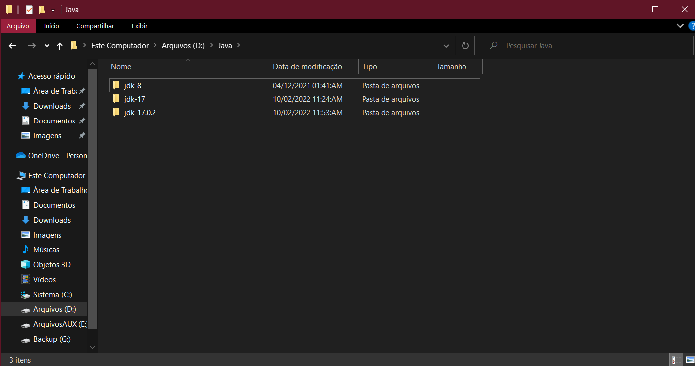
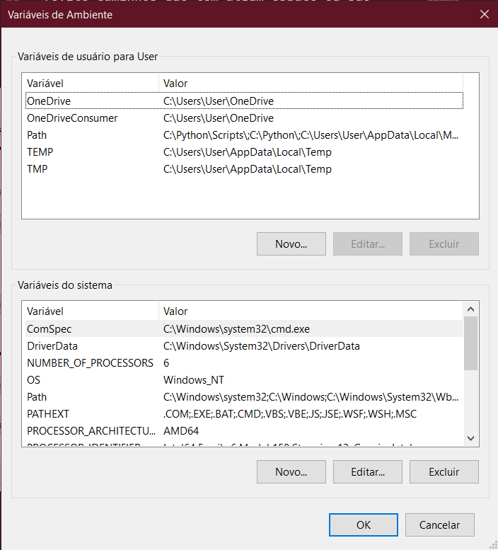
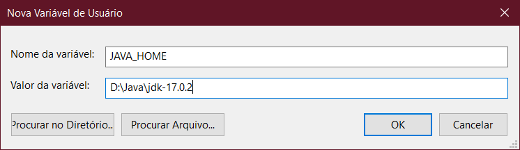
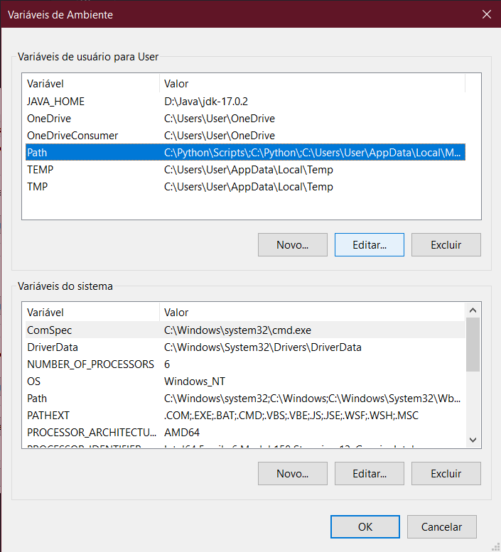
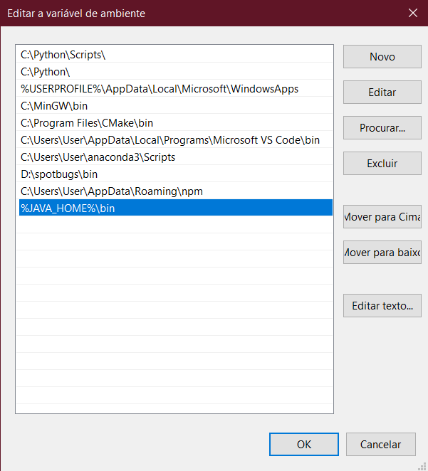
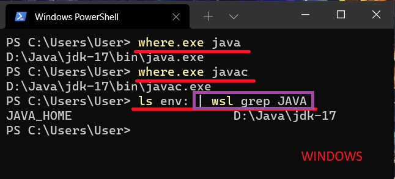
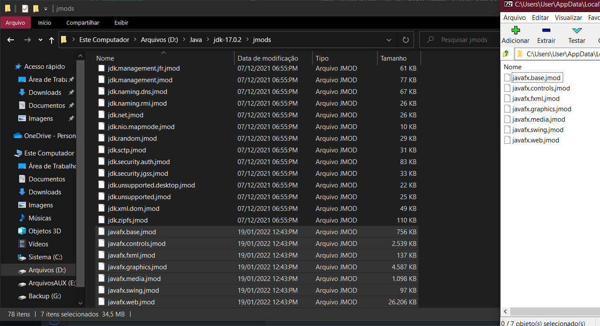

# 1

> O primeiro passo é baixar os binários do JDK em formato zip

- [clique aqui para baixar](https://download.java.net/java/GA/jdk17.0.2/dfd4a8d0985749f896bed50d7138ee7f/8/GPL/openjdk-17.0.2_windows-x64_bin.zip), pode salvar o zip onde quiser.

# 2

> O segundo passo é extrair esse arquivo zip em alguma pasta fácil de achar no seu sistema

(evite caminhos que tem algum espaço ou são protegidos pelo sistema)

- Exemplos errados:
  - C:\Program Files\Java
  - C:\Windows\System32
- Exemplos corretos:
  - C:\Java (recomendado)


Você pode ter várias versões do java ao mesmo tempo.

# 3

> O terceiro passo é configurar as variáveis de ambiente do sistema
> Esse passo pode variar dependendo da versão do windows.

- Digite na barra de pesquisa do windows 10 (aquele perto do ícone da cortana):
  ```
  editar as variáveis de ambiente do sistema
  ```
- Pode abrir o primeiro programa que aparecer
- Na janela que surgir, aperte o botão "Variáveis de ambiente..."

## 3.1

Essa janela é o programa de gerenciamento de variáveis de ambiente do windows. A seção de cima são as variáveis de ambiente do seu usuário logado, a seção de baixo são as variáveis de ambiente globais.



- Primeiro certifique-se que não existe nenhuma variável chamada JAVA_HOME ou JDK_HOME na seção de cima e na seção de baixo.
  - Se houver, apague.
- Na seção de cima, aperte no botão novo para criar a variável JAVA_HOME
  - Escreva assim no formulário:
    
  - o valor da variável tem que ser o caminho de onde você extraiu o zip no passo 2
- Agora clique na variável Path (da seção de cima) e clique em editar
  
- Na janela que abrir certifique-se que não existe nenhum caminho que aponte para algum java (ex: C:\Program Files\Java\...)
  - se houver, apague.
  - ATENÇÃO: existe uma variável path na seção de baixo do aplicativo, você deve se certificar se não existe nenhum caminho java lá também. (provavelmente não vai ter mas é bom checar)
- Crie um novo caminho exatamente como na foto a seguir:
  
- clique em OK e feche os programas

# 4

> O passo 4 é testar pra ver se deu certo

- Abra um terminal powershell novo e teste esses comandos
  
  - O quadrado roxo é opcional e só vai funcionar se você tiver o wsl, se ignorar o quadrado roxo o windows vai mostrar todas as variáveis, ai você tem que procurar se a JAVA_HOME está correta.

# 5

> O passo 5 é instalar o JavaFX que pode ser útil ao compilar o jabref. Esse passo é opcional.

- [baixe o binário do javafx](https://download2.gluonhq.com/openjfx/17.0.2/openjfx-17.0.2_windows-x64_bin-jmods.zip)
- procure a pasta onde você instalou o java
  - dentro dela tem que existir uma pasta chamada jmods
  - mova os arquivos do zip (os arquivos, não a pasta) para dentro da pasta jmods
    
